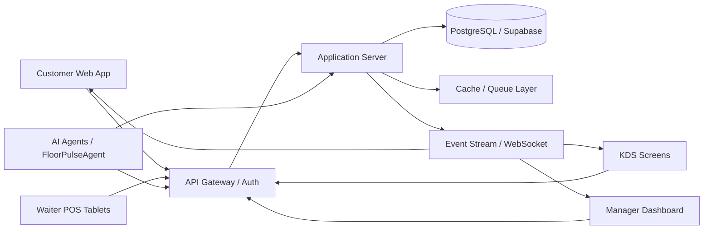

# DineMate Architecture

## 1. Overview

DineMate is an AI-powered restaurant operating system designed for modern dining venues. It combines digital ordering, staff coordination, kitchen visibility, and predictive insights into a single SaaS platform that supports front-of-house, back-of-house, and management workflows.

The platform is organized around a modular architecture with:
- Customer-facing web experiences for ordering and reservations
- Staff and manager dashboards for operations and analytics
- Kitchen display integrations for rapid ticket handling
- AI agents that monitor floor activity, forecast demand, and suggest actions

## 2. Tech Stack

### Frontend
- React 19
- Vite 8
- Tailwind CSS 4
- Lucide Icons
- Recharts
- Framer Motion
- React Router
- Zustand for state management

### Backend
- Node.js / Express (recommended service layer)
- RESTful API design
- JWT-based authentication
- WebSocket or Server-Sent Events for live updates

### Data Layer
- PostgreSQL / Supabase (primary relational data store)
- Optional MongoDB for event logs or unstructured analytics data
- Redis-style caching for hot lookups and queue state

## 3. Core Domains

### Customer Experience
- Web ordering and reservation flows
- Loyalty programs and personalized promos
- Real-time status updates for pickup and table service

### Operations
- Table management and seating plans
- Order lifecycle and kitchen ticketing
- Billing and settlement workflows

### Intelligence
- Floor traffic monitoring
- Rush forecasting
- Inventory risk alerts
- Upselling and engagement suggestions

## 4. Data Model / Schema

### Users
| Field | Type | Notes |
| --- | --- | --- |
| id | UUID | Primary key |
| role | enum | staff, manager, customer, admin |
| name | string | Display name |
| email | string | Unique |
| password_hash | string | Hashed |
| phone | string | Optional |
| status | enum | active, suspended |

### Tables / Seating
| Field | Type | Notes |
| --- | --- | --- |
| id | UUID | Primary key |
| table_number | int | Unique within venue |
| capacity | int | Seating size |
| status | enum | available, occupied, reserved, cleaning |
| location_zone | string | Patio, indoor, bar |

### Menu Items
| Field | Type | Notes |
| --- | --- | --- |
| id | UUID | Primary key |
| name | string | Menu name |
| category | string | Appetizer, main, dessert |
| price | decimal | Base price |
| stock_quantity | int | Inventory count |
| is_available | boolean | Visibility flag |
| tags | string[] | Vegan, spicy, chef special |

### Orders / Tickets
| Field | Type | Notes |
| --- | --- | --- |
| id | UUID | Primary key |
| order_number | string | Human-readable order ID |
| customer_id | UUID | FK to user |
| table_id | UUID | FK to table |
| status | enum | pending, preparing, ready, served, paid |
| subtotal | decimal | Pre-tax value |
| tax | decimal | Tax amount |
| total | decimal | Final amount |
| created_at | timestamp | Order creation |

### Kitchen Queue
| Field | Type | Notes |
| --- | --- | --- |
| id | UUID | Primary key |
| order_id | UUID | FK to order |
| item_id | UUID | FK to menu item |
| priority | enum | normal, urgent, vip |
| status | enum | queued, in_progress, completed |
| assigned_station | string | Grill, expo, bar |

### AI Floor Insights
| Field | Type | Notes |
| --- | --- | --- |
| id | UUID | Primary key |
| venue_id | UUID | Organization scope |
| observed_at | timestamp | Event time |
| occupancy_rate | decimal | Peak occupancy ratio |
| rush_forecast | string | Low, medium, high |
| flag_items | string[] | Low stock or high-demand items |
| upsell_suggestions | json | Suggested actions |

## 5. High-Level Design

## 6. Runtime Flow

1. Customers place orders or make reservations through the web app.
2. The server validates requests, stores transactional data, and publishes events.
3. Kitchen staff receive updated order states through KDS or tablet views.
4. Managers monitor live business metrics through dashboards.
5. AI agents analyze real-time activity and provide operational recommendations.

## 7. Deployment Considerations

- Use environment-based configuration for API keys and secrets.
- Separate development, staging, and production environments.
- Enable structured logging and audit trails for all order and AI actions.
- Protect sensitive operations with role-based access control.
